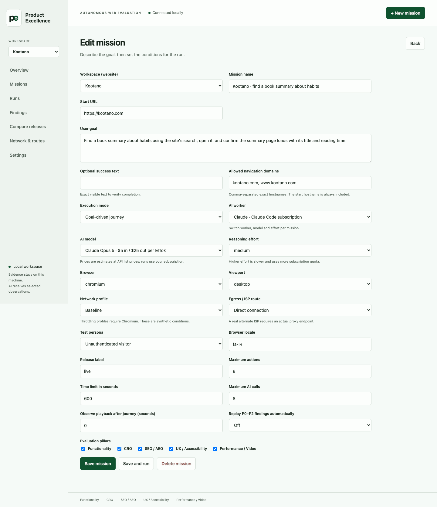
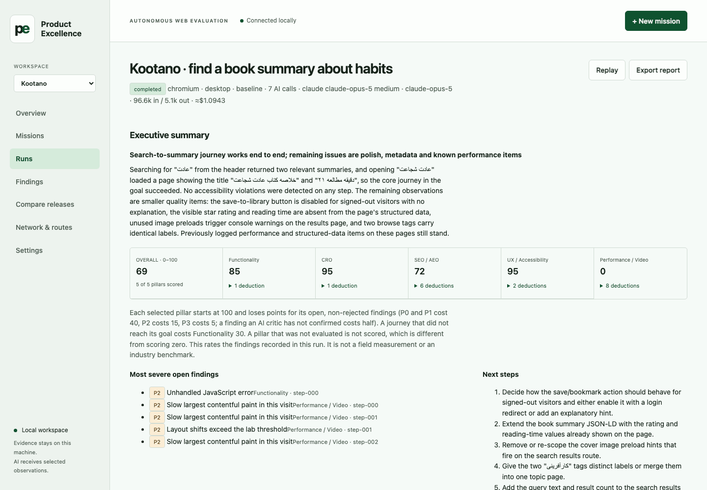
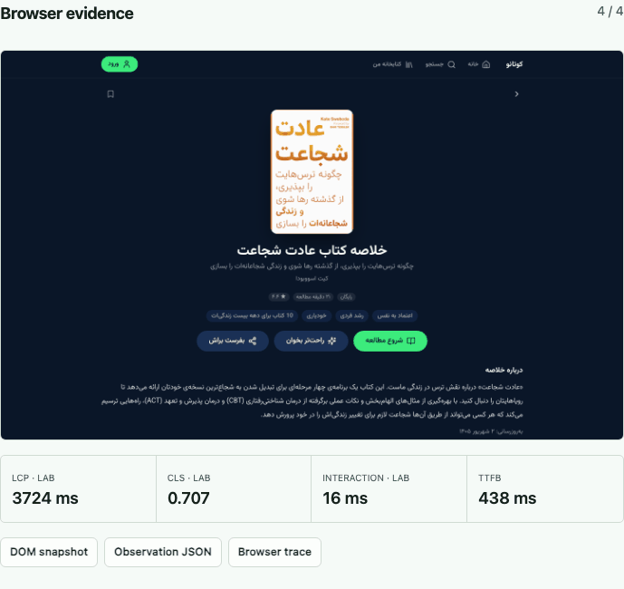
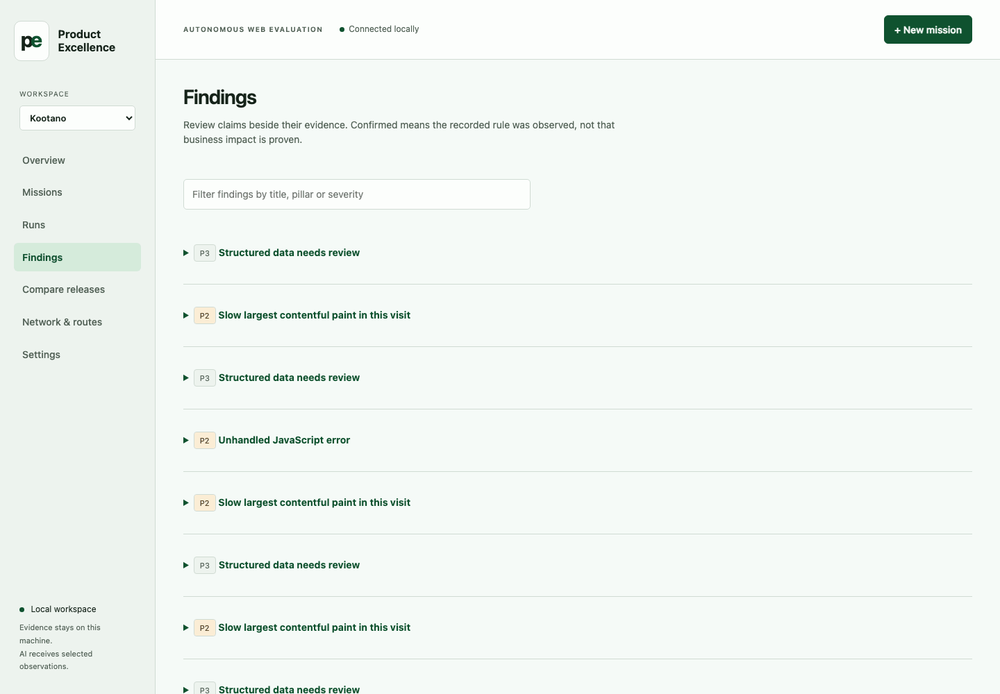
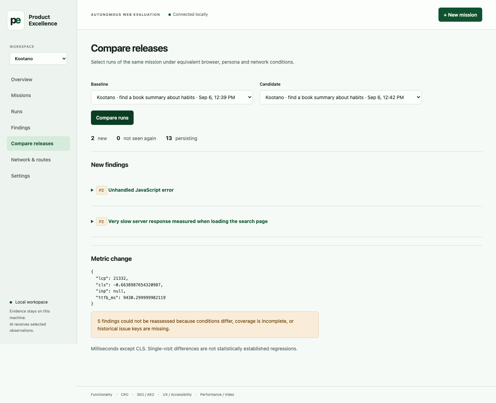
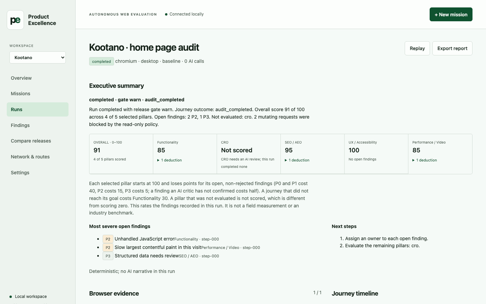
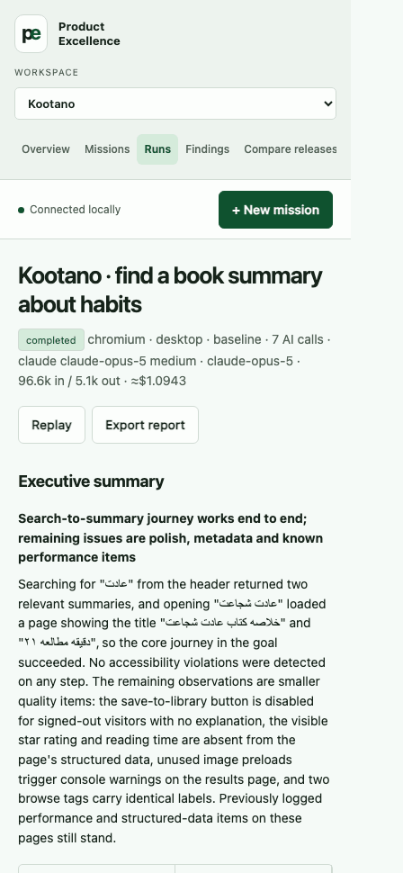

# Product Excellence

Product Excellence is a website and Android app testing assistant that runs on
your own Mac. Give it a page or installed-app task and it saves screenshots,
actions, recording, available measurements and findings for review.

Each workspace can contain multiple website and Android targets while keeping
missions, runs and findings separate. It signs in with your Claude or ChatGPT subscription through
their command line tools, so there are no API keys to manage.

Version 1.5.2. New here? Read the [user manual](docs/USER_MANUAL.md).

## Video demo

Five demonstrations of real runs. The narration is in Persian.

### Introduction

[](https://www.youtube.com/watch?v=r8QQtYkrxb4)

The agent moves through a website or Android app like a real user, keeps
screenshots and video, and prioritizes findings across UX, accessibility, SEO,
AEO, CRO and performance.

### Android app QA

[](https://www.youtube.com/watch?v=VwYABsNf4u4)

Upload an APK, run a mission on the emulator, keep actions, screenshots and
video, then compare app versions to catch regressions before release.

### Benchmark, network and release comparison

[](https://www.youtube.com/watch?v=Ok6i2ArJwgQ)

Compare two releases, separate new, resolved and persisting findings, throttle
the network or route through a proxy, and share results on your own team server.

### Competitor benchmark demo

[](https://www.youtube.com/watch?v=SKGr2jgTstw)

One real user goal run read-only across Ring, Filimo and their competitors: an
apartment search and picking a comedy series, scored on the same criteria.

### Video player test (Aparat)

[](https://www.youtube.com/watch?v=XNXlnK2NqOc)

Play, seek, volume, quality, speed and full screen exercised like a user, with
UX, accessibility, SEO, AEO, CRO, performance, JavaScript errors and network
findings in one run.

## First Android run

Android is optional. Install its tools and create the disposable `pex-test` AVD:

```bash
scripts/setup.sh --android
PEX_ANDROID_AVD=pex-test ./start.command
```

In **Settings → Targets and app builds**, add an Android target and upload a
universal or Java-only APK. Create a mission for that target, choose the build
and `pex-test`, then run it. The APK's package data is cleared for each mission;
the AVD is never wiped. APK bytes stay on this Mac even when metadata is shared.

## Product tour

### Define a mission

Describe the user goal, allowed domains, browser conditions, AI worker and run budget.




### Review the result

See the executive summary, pillar scores, severe findings and recommended next steps.




### Inspect browser evidence

Open each captured page beside its lab performance measurements and saved artifacts.




### Triage findings

Filter recorded issues by title, pillar or severity, then assign owners and track status.




### Compare releases

Separate new, resolved and persisting findings while reviewing metric changes between runs.




### Run deterministic audits

Use the same evidence and scoring view without an AI worker when a deterministic check is enough.




### Use it on smaller screens

The run report adapts to a narrow mobile layout for reviewing results away from a desktop.




## What you need

- A Mac.
- Git, available through Apple’s Command Line Tools (`xcode-select --install`).
- Internet access for setup, website testing, and AI reviews.
- A Claude Code or ChatGPT subscription, signed in on this Mac. You need one of
  these two, and you can run deterministic checks without either.

```bash
claude auth login
codex login
```

## Install it

```bash
git clone https://github.com/parhumm/product-excellence.git
cd product-excellence
./start.command
```

The first start installs everything it needs and takes several minutes, mostly
downloading three browsers. Then your browser opens at
**http://127.0.0.1:8741**. Later starts take a second.

You can also double-click **start.command** in Finder instead of typing the last
command. Leave its terminal window open while you use the app.

## Run your first test

1. Open **Settings → Workspaces (websites)** and add your website and its allowed
   domains. Pick it in the **Workspace** selector. Only test websites you are
   authorized to evaluate.
2. Open **Missions**. Every workspace starts with ten ready missions covering the
   home page, sign-up, sign-in, search, the main features, pricing, the mobile
   app, search visibility, accessibility and a slow phone.
3. Choose one and press **Run**. Missions that need an account will ask for one
   first.
4. Watch the timeline fill in. Click any step to see its screenshot and what was
   measured there.
5. Read the summary and the scores at the top of the finished run, open the
   findings, and check the evidence behind each one. **Replay** runs the same
   test again to see whether a finding comes back.

Download a report from the finished run to share it, or publish it to your team
server, below.

The [user manual](docs/USER_MANUAL.md) explains missions, scores, competitor
benchmarks, test accounts and the limits of what any of this proves.

To test something the ten presets do not cover, open Claude Code in this folder
and type `/pex-mission-write` followed by a plain sentence. The
[skills guide](docs/SKILLS.md) lists the eight skills that come with the app.

## Stop and restart

Close the terminal window, or press Ctrl+C in it. To start again, run
`./start.command`.

Everything the app records lives in the `data/` folder next to the code: the
database, screenshots, recordings and saved sign-in sessions. AI-enabled runs
send selected page evidence and screenshots to the selected AI provider through
its CLI. A connected team server receives shared run records and evidence
automatically. Keep `data/` private and use test accounts: recordings and page
content can contain personal information. Read the [privacy guide](docs/PRIVACY.md).

## Work with your team

If your team runs a server, open **Settings → Team server**, enter its address
and the username and password for the website you work on. Ask whoever
administers the server for both. Use your own team server; no shared account
or public hosted service is included.

Signing in shares that one workspace: its missions, runs, findings and
recordings live on the server and everyone signed in to it sees the same
results. Every other workspace stays on this Mac with all of its features, and
the sidebar picker groups the two under **On this Mac** and **Shared on** the
server. Each page says where the workspace you are looking at lives, and a run
that finished while the server was unreachable reads **Awaiting upload** until
its evidence arrives. Tests always run on your own Mac with your own
subscription. Signing out of a workspace returns it to nobody: it stays on the
server until you sign in again.

**Settings → Add workspace** creates one on this Mac; signed in as the server's
admin, the same form creates a shared one and signs you in to it.

Setting up or updating that server is in the [deployment guide](docs/DEPLOY.md).

## When something goes wrong

- **Settings says no AI worker is available.** Sign in with `claude auth login`
  or `codex login`, then reload Settings. Runs marked **No AI** work either way.
- **A browser is missing, or a run fails to start one.** Run `./scripts/setup.sh`
  again. It is safe to repeat.
- **"Another local app or import is using this data directory."** The app is
  already running in another terminal window. Use that one, or close it first.
- **Settings shows pending uploads.** The team server was unreachable when a run
  finished. Press **Retry uploads**. Your evidence is safe on this Mac until it
  succeeds.
- **"The team server is not responding."** The console still opens and shows the
  last copy it received, with the time it was synced. Lists it has never received
  appear empty until the server answers. Saving changes and starting runs work
  again once it does; press **Try again** to check. Nothing you have on this Mac
  is lost.
- **Safari keeps asking for the team server password.** Press Cancel once after
  signing out. That completes the sign-out.
- **Something else.** `.venv/bin/python scripts/cli.py health` prints the version and what the
  app thinks is ready. Include that output when you report a problem. In Claude
  Code, `/pex-env-check` reads it for you and `/pex-issue-report` writes the
  report.

## More

- [User manual](docs/USER_MANUAL.md) — how to use it, in plain language.
- [Skills guide](docs/SKILLS.md) — the eight Claude Code skills that come with it.
- [Deployment guide](docs/DEPLOY.md) — set up and update the team server.
- [Reference](docs/REFERENCE.md) — every setting, the command line, how things
  are measured, and what this tool does not do.
- [What is verified](docs/FEATURE_STATUS.md) — which capabilities were tested,
  and how.
- [Changelog](CHANGELOG.md).

## Development and safe sharing

macOS is the supported local setup. The optional team server runs on Debian or
Ubuntu; Windows and other local platforms have not been verified.

Contributions are welcome: see [CONTRIBUTING.md](CONTRIBUTING.md) for setup and
offline checks. Read [SECURITY.md](SECURITY.md) before reporting a vulnerability.
Never attach `data/`, environment files, account sessions or unreviewed recordings
to an issue. Maintainers should follow the [public release guide](docs/PUBLIC_RELEASE.md).

## Author and license

Created by [Parhum Khoshbakht](https://www.linkedin.com/in/parhumm/).

Project code and documentation are available under the
[Apache License 2.0](LICENSE). Bundled material keeps the separate terms listed
in [THIRD_PARTY_NOTICES.md](THIRD_PARTY_NOTICES.md).
